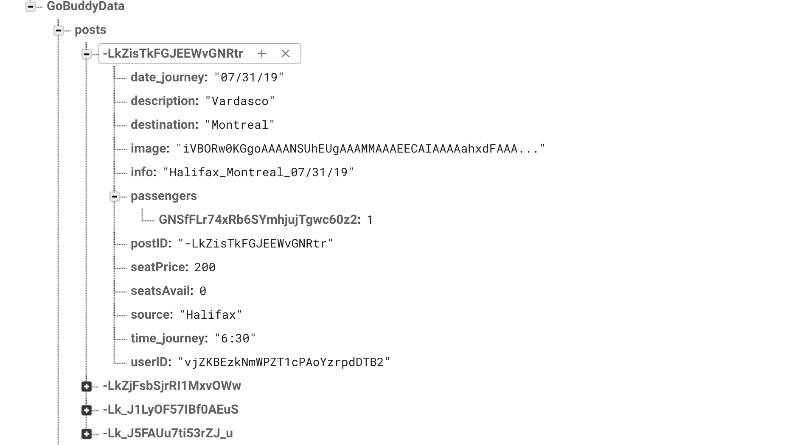
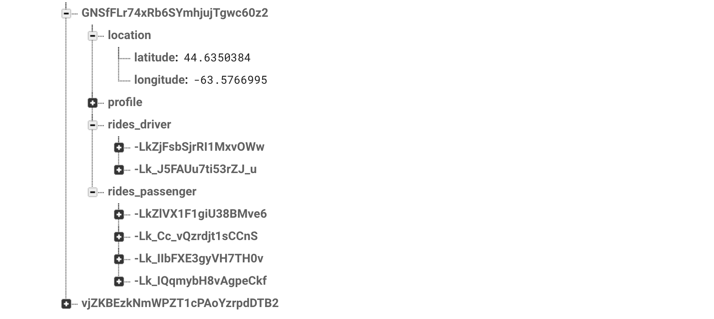
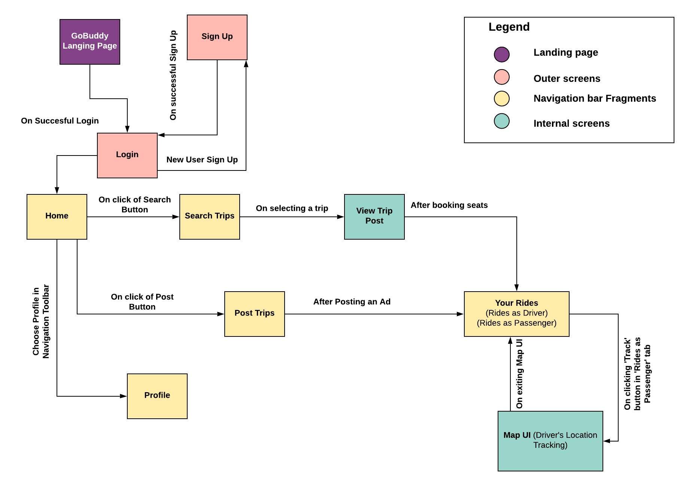

# GoBuddy
GoBuddy is a ride-sharing application that connects travelers across Canada and help them share their rides with passengers who are traveling to the same destination. The app can be accessed by both, drivers (users who are driving somewhere, and are planning to share their ride) and passengers (users who are looking for a ride to their destination). Drivers can post ads about their trips, including details like their Source, Destination, Date of Journey (DOJ), Number of seats available, Vehicle image etc. Passenger can search for available rides based on the Source, Destination and Date of Journey, and book seats for that trip, if they like it. This app connects drivers with passengers efficiently, and in real-time. Additional support like tracking location makes it a great app to use.

## Team Members

| Name 	| B00 Number 	| Email 	|
|---	|---	|---	|
| Shruthi Ramesh Kalasapura 	| B00822766 | shruthikramesh@dal.ca |
|  Anirudh Rayasam	| B00824329 	| anirudh.rayasam@dal.ca 	|

## Description

Canada is one of the largest countries in the world, and majority of the travel across Canada happens either by road or in air. While flights are the preferred way of travelling long distances, they often get expensive, and also, many people enjoy a long, fun and affordable drive. This was our motivation to build this app; a gateway for people to connect and share their rides with others and have a memorable trip.

People can find others who are traveling to the same destination, and tag along, using this app. This will help both, the driver and the passenger, cut costs by a great margin, and have an affordable ride. Furthermore, it is a great way to connect with new people and have a fun and memorable journey. With the absence of any such app in Canada, we thought it would be exciting to build one.

### Users

Our target-audience are all the people in Canada who are looking for an affordable, long journey from one city to another. More specifically, we are looking at students who travel for education or casual trips, people who travel regularly for work/business, backpackers looking for affordable travel options etc.

This application is only for the country, Canada. Rides locations across all provinces are valid, and majorly depend on the drivers who’re traveling. It is obvious that users will find more trips in busier cities like Toronto and Ottawa while very few in the northern provinces like Nunavut.

### Features

**Note:** There are two types of users for this app – Passenger and Driver. 
_Passenger:_ Users who wish to find trips and travel along with the driver on the journey. A passenger books seats from trip ads.
_Driver:_ User who is traveling to a specific destination and is looking for passengers to join the trip. A driver posts ad on the application.
_User:_ Could be either of the above two.

- A user can sign-up with his/her email ID, and other basic features like Name, Sex and Phone Number.
-	A user can also include a profile picture while signing-up.
-	A user can login to the application using the set Email ID and password.
-	A passenger can search for trips based on the source, destination and date of journey.
-	Auto-suggest helps passenger find the right input for source and destination, and date-pickers helps choosing the right date, thereby reducing chances of erroneous input.
-	A passenger can choose a particular trip and book seats for it, from the available seats.
-	A passenger can view details of the driver of the trip before booking seats for the trip.
-	A passenger can view all of his/her booked trips under the ‘Your Rides’ section of the app.
-	A driver can post ad about their trip on the app.
-	Auto-suggest for source and destination, and date and time pickers date pickers help drivers choose the correct values for their ads. 
-	A driver can include a picture of their vehicle and a brief description about it while posting an ad.
-	A driver can view all his/her posts in the ‘Your Rides’ section of the app.
-	Driver’s current location is automatically captured when the driver logs in to the app.
-	A passenger can see the driver’s current location for tracking.
-	A passenger can open an in-app map UI and see the driver’s location in the form of a marker. On-click of this marker, the passenger can open Google Maps app to check distance between him/her and the driver.
-	A user can view his/her profile details, including the profile picture, under the Profiles section of the app.
-	A user can navigate to Search and Post-Ad screen from the home screen of the app.
-	A user can go through details like ‘How to?’ and ‘Contact Us’ at the home screen of the app.
-	Communication – a passenger can communicate with the driver through SMS services of the mobile device.

## Libraries
- **AppCompat**: This library adds support for the Action Bar user interface design pattern. This library includes support for material design user interface implementations. Source [https://developer.android.com/topic/libraries/support-library/packages]
- **Recycler View**: The recyclerview library adds the RecyclerView class. This class provides support for the RecyclerView widget, a view for efficiently displaying large data sets by providing a limited window of data items. Source: [https://developer.android.com/topic/libraries/support-library/packages]
- **Support Libraries**: These libraries include the largest set of APIs compared to the other libraries, including support for application components, user interface features, accessibility, data handling, network connectivity, and programming utilities. Source: [https://developer.android.com/topic/libraries/support-library/packages]
- **Constraint Layout**: A ConstraintLayout is a android.view.ViewGroup which allows you to position and size widgets in a flexible way. Source: [https://developer.android.com/reference/android/support/constraint/ConstraintLayout]
- **Firebase libraries**: All these libraries help with implementing different firebase features like, Firebase Databasew, Firebase Authentication, etc. Source: [https://firebase.google.com/docs/libraries]
- **Android Support Annotations**: These set of libraries help with code inspection and many more. Source: [https://developer.android.com/reference/android/support/annotation/package-summary]
- **Lifecycle**: Lifecycle-aware components perform actions in response to a change in the lifecycle status of another component, such as activities and fragments. These components help you produce better-organized, and often lighter-weight code, that is easier to maintain. See the reference docs for more information. Source: [https://developer.android.com/jetpack/androidx/releases/lifecycle]
- **Places**: Locations related library. Source: [https://developers.google.com/places/android-sdk/reference/com/google/android/libraries/places/api/model/package-summary]
- **Circle Image View**: A library for getting a circular ImageView. Source: [[1]"hdodenhof/CircleImageView", GitHub. [Online]. Available: https://github.com/hdodenhof/CircleImageView. [Accessed: 24- Jul- 2019].]

**Note:** The source links have intentionally been kept as URLs and not in IEEE format because, one, it looks untidy and two, since all the above are direct library links, we thought IEEE citation wouldn't make sense. 

## Requirements

- OS: Android 6.0 (Marshmallow) or higher.
- Camera access.
- GPS access.
- Internet access.
- Network access.
- SMS access.

## Installation notes

The application gets installed directly from the APK file. No additional support is required.

## Final Project Completion Status

The application development cycle was divided into three major milestones, each milestone covering implementation of few useful functionalities. 
### Milestone 1: 
This is the first phase of project where the following tasks have been performed:
•	Research on various android development features and analysis of APIs required to implement our mobile features and key functionalities.
•	Development of Sitemaps and Clickstreams as a part of initial high-level design and organization.
•	Building the initial wireframes for the major application screens.
•	Implementation of Minimum Functionality of the application. The following functions were implemented as a part of this (brief descriptions below):
- Functionality where a driver posts an ad about their trip, and it gets stored into the Firebase Database.
- A passenger’s ability to fetch details of available trips, from the database, by searching for them.
- The application’s ability to connect to the Internet, and show real-time data of trips to both, the driver and the passenger.
- A driver’s ability to click and post a picture of his or her vehicle, as a part of the trip’s ad.
- Initial validations like searching based on the combination of Source, Destination and Date of Journey.

### Milestone 2: 
This was a crucial milestone as this covered implementation of Expected Functionalities and few other important aspects.
•	Performing unit and integrated testing of the minimum functionality.
•	Fixing bugs that have been identified as a part of the above point.
•	Implementation of the Expected Functionalities (brief descriptions below):
- The functionality where a passenger selects a suitable trip based on his/her search results, and book the number of seats he or she requires, in that trip.
- The functionality where the booking data is stored in a collection, inside the database.
- Functionality where all the rides, those which were posted by drivers as ads, and those that were booked by passengers, are displayed under the ‘Your Rides’ section. ‘Rides as Driver’ and ‘Rides as Passengers’ are two tabs that segregate the ride details accurately, based on the user that is logged in.

•	Implementation of few Bonus Functionalities were also done (brief descriptions below):
- User Sign-Up and Login functionality, where the credentials are stored in Firebase Authentication module for concrete authentication.
- The ability for a user to upload profile picture using phone camera, while signing up.
- The ability for a user to upload profile picture using phone’s gallery, while signing up.

•	Minimum polish has been performed.
•	Unit and integrated testing of most of the above implemented functionalities, and fixing identified bugs.
•	We’ve performed a prognosis and decided on what functionalities can be implemented, and what cannot, considering the timelines, pace and complexity of the functionalities left. 

### Milestone 3:
This is the final milestone, leading us towards the completion of the project implementation.
•	Firstly, we finished the remaining important functionalities’ implementation (brief description below):
- Implementation of the ‘Location Tracking’ feature, one of the top features of this application, is completed. It works this way – when the user accesses the app, the device location is identified and stored in the database. That location data is then retrieved by the passengers when the passengers click on ‘Track Driver’ button in their ‘Your Rides’ section. This opens up a Map Activity, showing a marker at the driver’s location. That marker can be opened in the ‘Google Maps’ app and driver location can be tracked accurately.
- Implemented functionality for communication between passenger and driver. A passenger can communicate with the driver through SMS from mobile network.
- Database implementation for storing a user’s account and/or profile details.

•	Continued Polishing the application and gave it a decent look and feel. It is clean, tidy and usable.
•	Integrated testing has been performed and most of the bugs have been fixed, making the app more robust.
•	Completed development of the application, as per the plan, covering all of the major functionalities, and few of the bonus functionalities. 
•	Final Project Report (this) has been documented.

### Achievement Status:
Milestone 1 and 2 were completely achieved as per the timeline. As a part of milestone 3, we implemented almost 77% of the Bonus Functionality section (more than what we actually planned for), and successfully achieved Milestone 3 completely, as well.

#### What couldn’t be implemented:
•	Couple of Bonus functionalities (Push-notifications and live-location tracking).
•	An excellently polished app (We could only polish it to a certain extent, because of lack of time).

## Code Examples
Being amateur android developers, we’ve come across many problems. The below are the major problem we faced.
1.	Building the database structure to accommodate all the data in a systematic manner.

     During the initial phase of development, we had a simple database structure in Firebase Database, but as the app grew, the structure had to be modified. This was a challenge because at one point, we couldn’t search firebase based on two criteria as firebase doesn’t support it. We had to come up with a solution of creating a primary-key like value that is a combination of the fields we required for searching. This solution worked like a charm. Below is the sample structure of our database.

    

    

	  
2.	We needed to track another user’s current location and display it on the current user’s device.

    We had an idea of fetching data from a feed and displaying locations as we worked on it as a part of an assignment. But finding the location of another person’s device and displaying it on the current user’s device was challenging. For this, we captured the user’s (driver’s) location when he/she logs in the app and stored the lat-long value in the DB, and fetched it on the current user’s (passenger’s) device on click of a button.

    

    

## Functional Decomposition

    

## High-level organization

    

## Clickstreams

    

## Layout

This section contains the initial wireframes designed for the application. These have changed with time as we improved the screens based on usability. We intend to put these here to show how the UI has transformed overtime.

    

## Implementation

    

    

## Future Work
•	We plan to implement the following major functionalities along:
- In-App messaging instead of SMS communication.
- Live-location tracking.
- Push notifications.

•	Introduce the rating and review system to increase the credibility factor of the users.
•	An in-app payment system to make secure payments (similar to that of swappa.com)
•	Initial user-testing of the app by friends and family, and eventually, by actual users.
•	If things go well, and if we’re motivated and confident enough, we shall launch it on Google Play and try to make it work locally, starting with friends and colleagues.

## References:
[1]A. Suda, "How to use FirebaseRecyclerAdpater with latest Firebase Dependencies in Android", Medium, 2018. [Online]. Available: https://medium.com/android-grid/how-to-use-firebaserecycleradpater-with-latest-firebase-dependencies-in-android-aff7a33adb8b. [Accessed: 24- Jul- 2019].

[2]A. Gupta, "guptaAbhishek/Android-Trainer-", GitHub, 2018. [Online]. Available: https://github.com/guptaAbhishek/Android-Trainer-/blob/master/app/src/main/java/com/example/siddarthshikhar/yomtrainerside/GooglePlacesAutocompleteAdapter.java. [Accessed: 24- Jul- 2019].

[3]P. Cegarra, "how to add the place holder image in android", Stack Overflow, 2016. [Online]. Available: https://stackoverflow.com/questions/33412856/how-to-add-the-place-holder-image-in-android. [Accessed: 24- Jul- 2019].

[4]S. Md, "Android Google Places Autocomplete feature tutorial with example", iteritory.com, 2018. [Online]. Available: https://iteritory.com/android-google-places-autocomplete-feature-tutorial-with-example/. [Accessed: 24- Jul- 2019].

[5]"Get started with the Navigation component  |  Android Developers", Android Developers. [Online]. Available: https://developer.android.com/guide/navigation/navigation-getting-started. [Accessed: 24- Jul- 2019].

[6]S. Agarwal, "Dialog to pick image from gallery or from camera", Stack Overflow, 2012. [Online]. Available: https://stackoverflow.com/questions/10165302/dialog-to-pick-image-from-gallery-or-from-camera. [Accessed: 24- Jul- 2019].

[7]V. Neel, "How to open messages from Android App using startActivityForResult()", Stack Overflow, 2016. [Online]. Available: https://stackoverflow.com/questions/37247542/how-to-open-messages-from-android-app-using-startactivityforresult. [Accessed: 24- Jul- 2019].

[8]"Tabs", Material Design. [Online]. Available: https://material.io/design/components/tabs.html#behavior. [Accessed: 24- Jul- 2019].

[9]"Upload Files on Android  |  Firebase", Firebase. [Online]. Available: https://firebase.google.com/docs/storage/android/upload-files. [Accessed: 24- Jul- 2019].

[10]"Firebase Authentication  |  Firebase", Firebase. [Online]. Available: https://firebase.google.com/docs/auth. [Accessed: 24- Jul- 2019].

[11]"Authenticate Using Google Sign-In on Android  |  Firebase", Firebase. [Online]. Available: https://firebase.google.com/docs/auth/android/google-signin. [Accessed: 24- Jul- 2019].

[12]P. Ekene Eze, "Add Firebase Authentication to your App in 7minutes", Medium, 2017. [Online]. Available: https://medium.com/@peterekeneeze/add-firebase-authentication-to-your-app-in-7minutes-c13df58994bd. [Accessed: 24- Jul- 2019].

